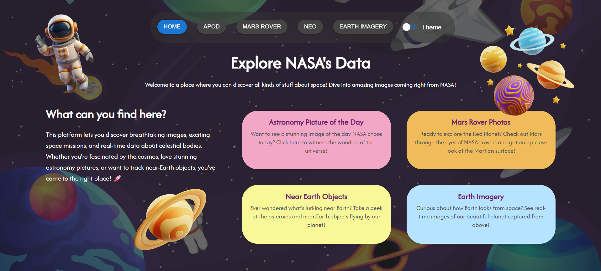

# INTERNSHIP
> 16th ASSIGNMENT

### NASA Explorer Web App



This is a React-based web application made to explore NASA's data collection using [NASA Open APIs](https://api.nasa.gov/). The idea behind this project was to gain more experience with React, focusing on routing, global state management, custom hooks, and higher-order components (HOC). Emphasis was placed on maintaining clean architecture, high-quality code, and a visually appealing design.  The application fetches data about astronomy pictures, Mars rovers, near-Earth objects, and Earth imagery.

### Key Features
<li>Full routing support, including a custom 404 page</li>
<li>Smooth navigation</li>
<li>Dynamic data fetching</li>
<li>Animations and interactive visuals</li>
<li>Dark/Light mode toggle</li>
<li>Custom hooks for API requests</li>
<li>Custom higher-order components</li>
<li>Error handling with Error Boundaries</li>

### Technologies used
<li>HTML5, CSS3</li>
<li>TypeScript, React</li>
<li>Visual Studio Code</li>
<li>Axios</li>
<li>localStorage</li>
<li>Material-UI (MUI), Google Fonts, Vecteezy (for image sources)</li>
<li>NASA Open APIs</li>
<li>Recharts and Leaflet.js (for data visualization)</li>


## Installation and running
To get started with this project, you need to have the following installed on your machine:
1. **A modern web browser**
2. **Visual Studio Code** (optional, but recommended)
3. **Node.js**

Steps to Install the Project:
1. **Clone and open the Repository**:
   Open a terminal (or command prompt on your machine) and run the following commands:
   
   ```bash
   git clone https://github.com/ivonaaaa/Internship-16-NASA.git
   ```
   ```bash
   cd Internship-16-NASA
   ```
2. **Open the project in VS Code**:
   In the same terminal type in this command:
    
   ```bash
   Code .
   ```

3. **Install the dependencies**:
   Once you're in the VS Code, open a new terminal and type in this command:
    
   ```bash
   npm install
   ```
4. **Set up the environment:**
   Create a .env file in the root of the project and add your NASA API key:
   ```bash
   VITE_NASA_API_KEY=your_api_key_here
   ```
   
6. **Run the application**:
   Start the app by running the following command:
    
   ```bash
   npm run dev
   ```
   Open the provided link in your browser to view the application.

